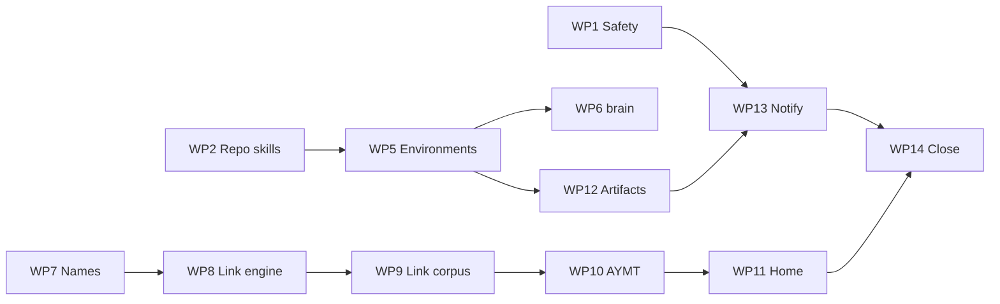

# Ready Backlog Implementation Plan

## Objective and authority

Resolve issues #4, #15, #21, #23, #71, #72, #73, #74, #75, #78, #79, #81, #82, #83, and #84 from the approved contract in [2026-08-11-ready-backlog-requirements-brainstorm](2026-08-11-ready-backlog-requirements-brainstorm.md). Ready PR #80 and non-Ready items are excluded.

This plan is review-gated because it proposes protected canonical changes, core renames, and a link-format migration. Approval authorizes only the repository work listed here. Real credentials/destinations, repository visibility, PATH/shell choices, and user-global installation retain explicit owner gates.

## Delivery rules

1. Safety (#83/#82) lands before connectors or new connected skills.
2. Brain behavior is spec-first; tooling stays stdlib-only.
3. Preview/apply protects bulk, global, adoption, and external writes.
4. #75 lands before #74; the dual-format link engine lands before the corpus rewrite.
5. Local artifacts precede hosting/notifications; AYMT precedes Home.
6. One reviewable PR per work package; #74 is split into engine and corpus PRs.
7. Close issues only after their requirements pass on merged `main`.
8. Every phase ends with full tests, validation, generated-file freshness, adoption smoke, and a focused adversarial review.

## Work packages and critical path

| WP | Issues | Package |
|---:|---|---|
| 1 | #83 | Remote safety gate |
| 2 | #82 | Project-local skill adapters |
| 3 | #81, #84 | Onboarding entry and atomic cleanup |
| 4 | #71, #72, #73 | Current-state dual-editor PRD |
| 5 | #15 | Environment identity/selection |
| 6 | #4 | Portable `brain` resolver/installer |
| 7 | #75 | Uppercase core filenames |
| 8 | #74 | Markdown link engine/migrator |
| 9 | #74 | Markdown corpus migration |
| 10 | #79 | AYMT |
| 11 | #78 | Home/editor startup |
| 12 | #23 | Local artifact pipeline |
| 13 | #21 | Push-only owner notifications |
| 14 | all | Final contract/closure |

Critical path: WP2 → WP5 → WP7 → WP8 → WP9 → WP10 → WP11 → WP12 → WP13 → WP14. WP1, WP3, and WP4 merge early before their dependents.

## Phase 0 — Baseline and approval

### Tasks

- [x] Refresh Project 3 and record any Ready-set change instead of silently changing scope.
- [x] Record `main` SHA, Python/Git versions, filesystem case behavior, and editor versions used for smoke tests.
- [x] Preserve unrelated work, including untracked `02_Inbox/2026-08-11-triage-report-2.md`.
- [x] Ensure hooks/merge driver are armed: `core.hooksPath=.githooks`, `merge.regenerate.driver=true`.
- [x] Baseline all Python tests, `brain validate`, index/snippet freshness, `adopt_check.py`, link metrics, repo-skill count, and long-form brain invocations.
- [x] Map every `R…` and `X…` requirement to a WP and verification check.
- [ ] Add planning/dependency links to the 15 issues after approval.

Exit: baseline is green or pre-existing failures are documented; plan approval is recorded; no unrelated file is staged.

## Phase 1 — Safety and onboarding

### WP1 — Remote safety (#83, P0)

Files: `brain.py`, brain spec/tests, `agent-orientation`, `onboard-owner`, operating rules, changelog.

- [x] Specify `brain remote-safety` states/reason codes and injectable provider boundary.
- [x] Enumerate push URLs; normalize/redact GitHub URL forms; query repository privacy/template metadata.
- [x] Fail closed on public/template/unknown before personal-data connector calls. Keep capability inventory separate.
- [x] Support local-only/no-push behavior and one-session unknown acknowledgment; verified public/template remains unoverrideable.
- [x] Integrate the shared guard into orientation, onboarding, and future personal-data adapters.
- [x] Test all URL/state/auth/provider/no-push cases in temporary repos; spy connectors must receive zero blocked calls.

Evidence: human/JSON examples for pass/block/unknown, redaction snapshots, full green suite, merged reference on #83.

### WP2 — Repo-local skills (#82)

Files: new deterministic adapter generator/tests; generated `.agents/skills` and `.claude/skills`; hooks/CI; `onboard-harness`; harness docs.

- [x] Derive adapter catalog from canonical skill frontmatter; mirror name/description and point to canonical SKILL.md.
- [x] Generate text adapters (no symlinks), version markers, `--check`, and missing/extra/collision/parity checks.
- [x] Enforce freshness in pre-commit/CI.
- [x] Make project verification the onboarding default. Global mode previews exact paths and writes only after consent.
- [x] Add fake-home canary; project/dry-run modes must make zero external writes.
- [x] Publish tested compatibility/trust table; leave Copilot on its current user-copy route until proven.

Evidence: clean clone exposes Codex repo skills, generator is byte-stable, CI detects drift.

### WP3 — Onboarding/adoption (#81/#84)

Files: `onboard-owner`, `adopt_examples.json`, `adopt_check.py`, fixtures/tests.

- [x] Add four starter intents, conditional recommendation, free-form answer, and change-later wording.
- [x] Remove selective example deletion; manifest becomes the sole bundle authority.
- [x] Add atomic plan/apply with exact deletions/reference edits, stale/dirty/unmarked-reference refusal, and post-apply validation.
- [x] Test the four reported dangling links, aliases, unmarked references, dirty files, and skill-contract wording.

Phase gate: WP1–WP3 requirements pass on merged `main`; no live connector/user-home write occurred; full privacy/destructive-action review passes.

## Phase 2 — Product contract

### WP4 — PRD rewrite (#71/#72/#73)

Files: `00_Meta/PRD.md`, status, changelog, operating rules; index only if navigation changes.

Target outline: definition/audience; goals/non-goals; cross-editor experience; architecture/write lanes; canonical/config/data contracts; agent model; privacy/restriction/sync; tooling/generated files; user journeys; current acceptance; shipped M0–M12; Ready roadmap; unresolved decisions.

- [x] Inventory PRD/status/conventions/rules/config/spec claims as current, stale, historical, duplicate, or unresolved.
- [x] Rewrite current claims in place; move meaningful history to one changelog entry; remove revision banners/addenda/resolved narrative.
- [x] Replace M0–M7-only and shipped-as-planned language.
- [x] Make Obsidian and VS Code contract-level throughout; separate editor-neutral integrity from enhancements.
- [x] Add the edit-in-place PRD maintenance rule and reconcile all current contracts.
- [x] Search for stale phrases and run a cross-document consistency/adversarial omission review.

Exit: #71/#72/#73 close together; PRD reads as current state; canonical docs agree and validation is green.

## Phase 3 — Environment and CLI

### WP5 — Environment model (#15)

Files: brain spec/code/tests; environments README; orientation/onboarding; config/conventions; `.gitignore`; report/sync/restriction tests.

- [x] Specify versioned `environment.json`, privacy-safe fingerprinting, ignored selector/overlay, and selection precedence.
- [x] Implement `brain env detect|list` and `--env current|slug`; ambiguity/no match fails closed.
- [x] Apply current-only filtering to bootstrap, search/report, maintenance, sync, and generated integrations.
- [x] Keep all-environment diagnostic metadata-only; never emit raw identity/path/secret.
- [x] Update orientation to generate/maintain the selected slug safely; preview migration of existing notes.
- [x] Test zero/one/two environments, all selection routes, conflicting infrastructure, sync classification, and privacy snapshots.

### WP6 — Portable `brain` (#4)

Files: POSIX/Windows launchers, installer or subcommand, tests, brain spec, active docs/tasks/skills.

- [x] Implement resolver precedence: `--vault`, `BRAIN_VAULT`, upward CWD walk for AGENTS + brain.py.
- [x] Preserve arguments/output/exit code; reject invalid/ambiguous roots.
- [x] Add install preview/apply, doctor, uninstall, recognized-overwrite protection, and reversible external manifest.
- [x] Prefer existing writable PATH directory; never edit shell rc automatically.
- [x] Test root/subdir, spaces/Unicode, nested/sibling forks, overrides, missing Python/tool, POSIX/Windows behavior.
- [x] Prefer `brain` in active docs after support lands, retaining long Python fallback.
- [x] Record current plugin-bin capability as unavailable; do not add a nonstandard manifest field.

Phase gate: two environments and two sibling forks cannot cross-select; install/dry-run tests touch no real home/shell config; #15/#4 acceptance passes.

## Phase 4 — Final core filenames

### WP7 — Uppercase core files (#75)

This PR is mechanical: no semantic content edits beyond path/reference updates.

- [x] Freeze the 14-file manifest from the requirements note and enumerate all references/constants/allowlists/tests.
- [x] Use two-step `git mv` for every case-only rename.
- [x] Update links, bootstrap budgets, code constants, settings/permissions, tests, tasks, and docs from one manifest where possible.
- [x] Regenerate index/snippets/adapters; add exact-case and filename-validation tests.
- [x] Require `git ls-files` exact final casing and no active old-case paths outside fixtures.
- [x] Smoke test bootstrap and navigation on case-sensitive and case-insensitive environments where CI permits.

Exit: #75 closes before #74; diff remains mechanical; all gates green.

## Phase 5 — Portable links

### WP8 — Dual-format engine/migrator (#74 part 1)

Files: brain spec/code/tests and migration fixtures; no maintained corpus rewrite yet.

- [x] Specify generic link records, source ranges, resolution/encoding/fragments/images/placeholders/block refs.
- [x] Parse Markdown while excluding YAML, fenced/inline code, escapes, and external URLs; retain legacy wikilinks with counts.
- [x] Resolve source-relative paths and tested heading slugs; report ambiguity instead of guessing.
- [x] Implement `brain migrate-links`: preview default, `--check`, `--json`, explicit `--write`, source hashes, deterministic atomic writes.
- [x] Preserve labels, fragments, self-links, images, encoding, and line endings; refuse stale/dirty/ambiguous/unsupported plans.
- [x] Test syntax/false positives, legacy import, idempotence, rollback, and a ≥ current-corpus performance fixture.

### WP9 — Corpus migration (#74 part 2)

- [x] Generate a complete categorized plan on merged WP8; manually sample each link class before apply.
- [x] Convert maintained content once; update conventions/templates/skills/examples/spec/solutions/tests to make relative Markdown canonical.
- [x] Regenerate snippets/index/adapters; configure/document Obsidian relative Markdown new links.
- [x] Retain only named legacy fixtures and run a second no-op migration.
- [x] Verify same/parent/child, spaces/Unicode, display label, heading, self-link, image, and placeholder in GitHub, VS Code, Obsidian, and brain.

Rollback: if the post-apply gate fails, revert the corpus PR as a unit while retaining WP8. Do not repair a partial migration on `main`.

Phase gate: zero maintained legacy/unresolved links; idempotence and three-surface matrix pass; full repository checks green; then close #74.

## Phase 6 — AYMT and Home

### WP10 — AYMT (#79)

Files: new AYMT skill + generated adapters; brain/helper spec/tests; proposed generated `00_Meta/AYMT.md`; config only if needed.

- [x] Define deterministic candidate schema and local collectors; GitHub is optional/authenticated.
- [x] Score urgency/leverage/effort/confidence/dependency/staleness, dedupe outcomes, cap at 5–7.
- [x] Render Do next / Unblock or decide / Keep warm with sources, why-now, next step, and caveat.
- [x] Apply restriction/current-environment filtering before candidate creation.
- [x] Add local-only, JSON explanation, preview/write/`--check`, stable-output tests.
- [x] Add a narrow generated-write exception only after canonical approval.

### WP11 — Home (#78)

Files: generator/spec/tests; proposed `00_Meta/HOME.md`; VS Code task/docs; Obsidian setting/onboarding.

- [x] Disposable-vault spike: toggle Obsidian 1.11 native default file and diff settings. Commit only a stable repository key; otherwise document setup + CLI fallback.
- [x] Generate Home separately from canonical INDEX using AYMT, tasks, Inbox, projects/areas, reviews, Now/status/changelog, expiry/health, and environment.
- [x] Keep maintainer GitHub backlog optional; omit missed-automation claims until a run-log contract exists.
- [x] Preserve VS Code's folder-open task; document trust/automatic-task recovery.
- [x] Test empty/adopted/stale/overdue/environment states, restriction filtering, deterministic check, startup, and navigation.

Phase gate: AYMT/Home are stable portable Markdown, INDEX is untouched by dynamic updates, and VS Code/Obsidian/GitHub behavior passes.

## Phase 7 — Local artifacts

### WP12 — Artifact pipeline (#23)

Files: new artifact skill/adapters; stdlib generator/tests; `08_Assets/artifacts/README.md`; templates/assets.

- [x] Define deterministic manifest/naming/scope and implement link-graph + health-dashboard data.
- [x] Filter restricted/non-current/secrets/absolute paths/raw bodies before serialization.
- [x] Generate offline HTML with escaped JSON, safe DOM text APIs, hashed CSP or local bundle, and zero CDN/runtime network.
- [x] Add static/JS-off summary, keyboard/accessibility/reduced-motion/empty states.
- [x] Document local browser/VS Code opening; define but disable hosting until environment configuration + owner consent.
- [x] Test golden bytes, injection, CSP/offline, privacy, accessibility, large-vault budget, and browser opening.

Exit: #23 local-first requirements pass without credentials/network; shared hosting remains explicitly optional.

## Phase 8 — Owner notifications

### WP13 — Push-only v1 (#21)

Provider gate: ask which existing private surface to use. If none is selected, merge envelope + fake/file transport but keep #21 open with one explicit owner action. Do not install a connector plugin merely to implement repository runtime behavior.

Files: new notification library/tests/fixtures and setup skill/adapters; environment overlay schema; non-secret config; operating-rule exception.

- [x] Define versioned provider-neutral envelope and privacy class; implement fake/file transport first.
- [ ] Implement exactly one selected real provider with text fallback and provider limits.
- [x] Keep credentials in ignored current-environment overlay/external manager; redact all boundaries.
- [ ] Verify/acknowledge private destination before one redacted test send.
- [x] Implement category opt-ins, owner-timezone quiet hours, rate limit, dedupe, bounded transient retry, and ignored delivery state.
- [x] Route producer payloads through the envelope contract; buttons are safe links only—no inbound mutation endpoint.
- [x] Add narrow owner-authorized operational-notification exception to “agents never ship.”
- [ ] Test categories, redaction, payload/fallback, DST/quiet hours, dedupe/rate/retry/corrupt state, and approved real-provider smoke.

Exit: no secret in git/logs/artifacts; fake contract passes; selected private channel receives one approved test; close #21 only then.

## Phase 9 — Consolidation and closure

### WP14 tasks

- [x] Update PRD/status once with final current behavior; add concise changelog entries, not implementation diaries.
- [x] Reconcile conventions, config, operating rules, task patterns, brain spec, environment/artifact/editor docs.
- [x] Regenerate index, snippets, and project skill adapters.
- [x] Search for old-case paths, maintained wikilinks, hardcoded deprecated invocations, secrets, hostnames, usernames, and absolute paths.
- [x] Re-run every requirement against the integrated branch; record honest test/link/skill metrics.
- [ ] Re-run the final gate against merged `main` before issue closure.
- [ ] For each issue, comment with merged PR/commit, acceptance evidence, adopted decisions, and limitations; then update project status and close.

### Final gate

| Check | Required result |
|---|---|
| All Python tests | 0 failures |
| `brain validate` | 0 errors |
| Index/snippets/skill adapters | all freshness checks clean |
| `adopt_check.py` | atomic cleanup green |
| Maintained links | 0 legacy, 0 unresolved |
| Secret/path privacy scans | 0 findings |
| Working tree | only explicitly preserved owner files |
| GitHub/VS Code/Obsidian | required link/home matrix passes |
| POSIX/Windows | launcher/path cases pass |
| Artifacts | offline/CSP/injection/accessibility pass |
| Notifications | fake + selected real smoke, no secrets |

Adversarial review lenses: privacy, wrong environment/fork, partial/destructive writes, parser correctness, case/path portability, spec drift, artifact injection/accessibility, notification leakage/spam.

## Risk and rollback register

| Risk | Mitigation / rollback |
|---|---|
| Personal data reaches public vault | WP1 first; fail closed; connector spy tests |
| Link corruption | dual-read engine, plan hashes, split corpus PR, unit revert |
| Case rename lost | two-step moves, exact-case CI |
| Skill drift/global writes | generated adapters, CI parity, fake-home canary |
| Wrong environment/fork | explicit precedence, ambiguity failure, two-env/two-fork tests |
| Artifact injection | escaped data/text APIs/CSP/offline and malicious fixtures |
| Webhook secret/spam | ignored overlay, redaction, opt-in categories, quiet/rate/dedupe |
| PRD loses valid behavior | claim inventory, consistency matrix, omission review |
| Editor startup mismatch | disposable-vault spike, versioned fallback |

## Owner action queue

- [x] Approve protected canonical changes and narrow generated HOME/AYMT exceptions.
- [ ] Select a private notification provider/destination or accept that #21 remains open after fake/file infrastructure.
- [ ] Store the selected credential outside git for the smoke test.
- [x] Retain the default of no user-global harness installation; repository-local discovery is active.
- [ ] Choose/add a PATH directory manually if no existing writable PATH directory exists; installer will not edit shell rc.
- [x] Keep real personal-data access disabled; live remote safety blocks this public template and cannot be bypassed.

## Progress ledger

| WP | Status | PR/commit | Gate |
|---:|---|---|---|
| 1–3 Safety/onboarding | Done; PASS | `0a8b007`…`f45c349` | Focused + full suite |
| 4 Product contract | Done; PASS | `6a3e227` | Consistency review |
| 5–6 Environment/CLI | Done; PASS | `1666e12`…`a1b9c5c` | Focused + full suite |
| 7 Names | Done; PASS | `4da9c55` | Exact-case suite |
| 8–9 Links | Done; PASS | `dcb7b8a`…`97700c9` | 0 legacy/unresolved |
| 10–11 AYMT/Home | Done; PASS | `b9360d2`, `6b2cd15` | Fresh + editor checks |
| 12 Artifacts | Done; PASS | `aa9a370` | Offline/privacy suite |
| 13 Notifications | Fake/file done; PASS | `7a3217f` | Real provider gate open |
| 14 Consolidation | In progress | current branch | Publish/closure pending |

## Execution evidence and requirement map

The rebaseline, R/X evidence, metrics, review record, final gates, and owner boundary are in [the completion audit](2026-08-12-ready-backlog-completion-audit.md).

## Immediate next action

Publish WP14 and its evidence; keep #21 open until its owner gate passes.
