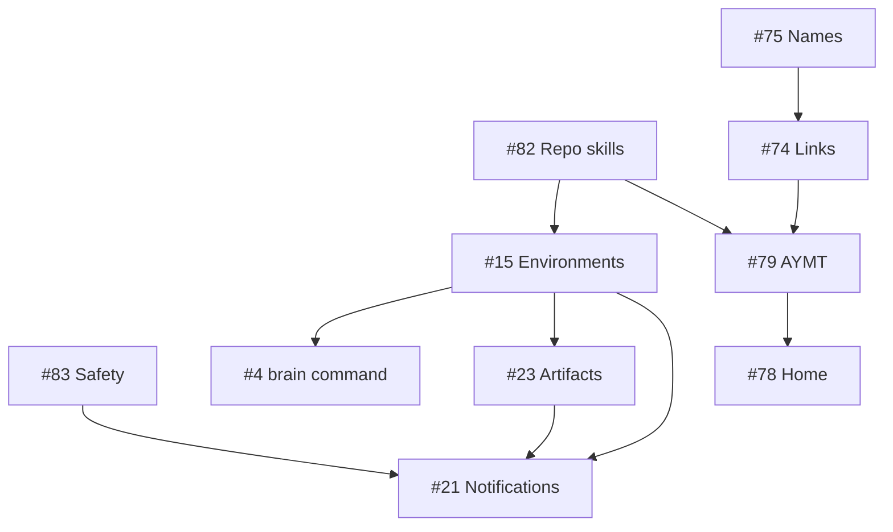

# Ready Backlog Requirements Brainstorm

## Purpose

Define one research-grounded contract for resolving every **Ready** issue in GitHub Project 3. The derived sequence is in [[02_Inbox/2026-08-11-ready-backlog-implementation-plan]]. This proposal does not authorize protected-note edits.

## Scope and rebaseline

Snapshot: [Project 3, Prioritized backlog](https://github.com/users/jvall0228/projects/3/views/3), 2026-08-11. Scope is the 15 issue items with project `Status = Ready`; Ready pull request #80 is excluded.

Included issues: P0 #83; P1 #71, #72, #73, #82; P2 #4, #15, #21, #23, #74, #75, #78, #79, #81, and #84. Each heading below maps to the same-numbered issue in `jvall0228/second_brain_template`.

Repository inspection at `main` commit `dea1756` changes several issue premises:

- M8–M12 are shipped, but PRD/status still describe only M0–M7 and contain stale planned language.
- VS Code already has a folder-open Homepage task; automatic execution still depends on trust and `task.allowAutomaticTasks`.
- Obsidian 1.11 added a native **Default file to open** setting, so #78 needs no community plugin.
- The index reports 717 links: 697 resolved, 20 placeholders, 294 aliases, 26 fragments, 0 block references, 0 real embeds, and 9 self-heading links. A current raw scan finds 778 wikilink-like occurrences across 120 files outside fixtures.
- The seeded-example manifest and cleanup tool already support an atomic bundle; #84 persists because onboarding still permits selective deletion.
- Codex officially loads checked-in `.agents/skills`, validating #82's project-local direction. Its current plugin manifest has no `bin` field, so #4 cannot truthfully expose a Codex plugin binary today.

## Definition of done

All 15 issues are resolved when their numbered requirements pass on merged `main`; access is consented and fail-closed; output is deterministic and private; and tests, validation, freshness, and platform smoke checks are green.

## Recommended decisions

| ID | Decision |
|---|---|
| D1 | Land safety (#83/#82) before integrations or new connected skills. |
| D2 | Unknown remote visibility blocks personal-data reads; verified public/template destinations cannot be overridden. |
| D3 | Ship generated text adapters in `.agents/skills` and `.claude/skills`; user-global wiring is optional. |
| D4 | Use a stable owner-chosen environment slug plus a separate privacy-safe fingerprint. |
| D5 | Install `brain` as a resolver shim so each fork runs its own checked-out tool. Do not invent unsupported plugin metadata. |
| D6 | Rewrite the PRD in place; changelog and git own history. |
| D7 | Rename the enumerated core files before converting links. |
| D8 | Add dual Markdown/wikilink reading before migration; standard relative Markdown becomes canonical afterward. |
| D9 | Keep canonical INDEX static; generate separate HOME and AYMT living snapshots under narrow approved write exceptions. |
| D10 | Generate AYMT before Home; deliver artifacts local-first; make notifications push-only in v1. |
| D11 | Treat all seeded examples as one atomic adoption bundle. |

## Cross-cutting requirements

- **X1 Safety:** network access is opt-in and never a validation/index/home side effect. Credentials and webhook URLs never enter git, output, artifacts, logs, or errors.
- **X2 Privacy:** restriction and current-environment filters run before serialization or provider formatting. Unknown remote state fails closed before personal-data access.
- **X3 Portability:** stdlib-only tooling; repository-relative POSIX paths in tracked data; case-safe renames; POSIX and Windows launchers; no committed symlink dependency.
- **X4 Determinism:** every generator has dry-run/`--check`, stable ordering, version/provenance, and byte-stable output for identical inputs.
- **X5 Mutation safety:** bulk, global, adoption, and external writes preview exact effects and refuse stale plans or overlapping user changes.
- **X6 Editor parity:** changes to links, navigation, templates, or homepage behavior explicitly cover Obsidian and VS Code; GitHub rendering is checked for portable Markdown.
- **X7 Documentation:** behavior-changing brain work is spec-first; superseded PRD claims are edited in place; snippets/adapters/indexes are generated, not hand-maintained.

## Workstream A — Safety and onboarding

### #83 — Remote safety gate

Outcome: onboarding/orientation cannot read calendar, email, contacts, or equivalent personal data for a public, template, or unverifiable push destination.

- **R83.1** Add a shared `brain remote-safety` evaluator with human and stable JSON output: `pass`, `block`, or `unknown` plus reason codes.
- **R83.2** Inspect all push URLs, not fetch-only public upstreams. Normalize GitHub SSH/HTTPS forms without printing credential-bearing URLs.
- **R83.3** For GitHub, query `visibility`, `isPrivate`, `isTemplate`, and `templateRepository`; model missing auth, unsupported hosts, malformed remotes, or timeouts as `unknown`.
- **R83.4** Pass only when every push target is verified private/non-template. Stop before connector invocation on `block` or `unknown`.
- **R83.5** Separate harmless capability inventory from data reads. Use the same guard in `agent-orientation`, `onboard-owner`, and future personal-data adapters.
- **R83.6** Permit one-session acknowledgment for `unknown` only; never bypass a verified public/template destination. No-push vaults remain local-only and cannot persist connector results.
- **R83.7** Test URL forms, multiple push URLs, public upstream/private origin, all visibility states, unavailable auth/tool/provider, no push remote, and redaction with temporary repos/fake providers.

Acceptance: blocked/unknown preflight yields zero connector calls; a private fork with public fetch-only upstream passes; logs expose no credential or local identity.

### #82 — Project-local harness discovery

- **R82.1** Generate committed adapters for all supported canonical skills under `.agents/skills/<name>/SKILL.md` and `.claude/skills/<name>/SKILL.md`.
- **R82.2** Adapters mirror canonical name/description and direct the harness to `10_Agents/skills/<name>/SKILL.md`; never duplicate workflow bodies or rely on symlinks.
- **R82.3** Add generator `--check`, byte-stability, missing/extra/collision, and metadata-parity tests; enforce freshness in hooks/CI.
- **R82.4** Make `onboard-harness` project verification the default. Global mode must preview exact external paths and require explicit consent.
- **R82.5** Reframe owner onboarding's harness step as optional availability outside this repository.
- **R82.6** Document the tested harness matrix and Pi trust caveat; keep Copilot's existing user-copy route until repository-scope behavior is proven.
- **R82.7** A fake-home canary test must fail if project/dry-run mode writes outside the clone.

Acceptance: a clean clone exposes Codex skills without onboarding; regeneration is clean; project mode makes no user-scope writes.

### #81 — Ask-and-recommend entry

- **R81.1** Stage 1 offers work, personal life, exploring both, and not sure yet, while accepting free-form input.
- **R81.2** Recommend one option when existing context supports it, explain why in one sentence, and let the owner change direction.
- **R81.3** Add a skill-contract test for the choices and recommendation behavior.

### #84 — Atomic example cleanup

- **R84.1** Make the existing manifest the sole seeded-example authority; remove selective-deletion instructions.
- **R84.2** Provide atomic plan/apply output listing every deletion and cleanup-marker edit.
- **R84.3** Abort before mutation on missing expected examples, unmarked surviving references, stale plan, or overlapping dirty files.
- **R84.4** Apply then validate zero unresolved links/markers. Test the four reported cross-links, aliases, unmarked references, and dirty-file refusal.

## Workstream B — Current product contract and portable content

### #71/#72/#73 — Maintained, dual-editor PRD

Implement as one coherent package.

- **R71.1** Update PRD/status for shipped M8–M12 and the approved Ready roadmap; remove already-shipped work from planned sections.
- **R71.2** Link historical release detail to changelog instead of copying it into the PRD.
- **R72.1** Sweep title, framing, goals, non-goals, personas, requirements, and acceptance criteria so Obsidian and VS Code are both contract-level surfaces.
- **R72.2** Separate editor-neutral integrity from editor enhancements and state parity duties for navigation, links, templates/snippets, homepage, and commands/tasks.
- **R73.1** Remove revision banners, append-only addenda, resolved incident prose, and resolved consideration logs.
- **R73.2** Organize around current goals, architecture/contracts, user journeys, acceptance criteria, live roadmap, and only genuinely unresolved decisions.
- **R73.3** Add an operating rule: edit superseded PRD claims in place; changelog records the change once; git holds full history.
- **R73.4** Reconcile current canonical artifacts, config, write exceptions, restrictions, sync/report behavior, and editor surfaces.

Acceptance: no reader must reconstruct current behavior from addenda; searches find no active M0–M7-only or Obsidian-only contract; PRD/status/changelog/conventions/rules agree.

### #75 — Uppercase core/framework filenames

Exact scope: `00_Meta/{CONVENTIONS,INDEX,CHANGELOG,PRD,STATUS}.md`; `01_Profile/{NOW,PREFERENCES,DEFAULTS,IDENTITY,WORK,TOOLING-STACK,LONG-RUNNING-THEMES}.md`; `10_Agents/docs/{OPERATING-RULES,TASK-PATTERNS}.md`.

- **R75.1** Encode this explicit 14-file manifest; do not uppercase every canonical or ordinary note.
- **R75.2** Use two-step case-only `git mv`; update links, code constants, config/permission paths, bootstrap budgets, tests, tasks, and docs together.
- **R75.3** Update filename validation without weakening kebab-case for ordinary notes; add exact-case regression tests.
- **R75.4** Complete before #74; require no active old-case reference outside migration fixtures.

### #74 — Standard Markdown links

- **R74.1** Generalize indexed link records for Markdown links/images and legacy wikilinks/embeds, including range, label, destination, fragment, format, embed flag, and resolution.
- **R74.2** Parse links while excluding YAML, fenced/inline code, escapes, and raw external URLs. Resolve source-relative paths, URL encoding, and tested heading slugs; report duplicate/ambiguous headings.
- **R74.3** Continue reading legacy wikilinks for imports, count them as legacy, and explicitly report placeholders and unsupported block refs.
- **R74.4** Add `brain migrate-links`: preview by default; `--check`, `--json`, explicit `--write`; source hashes and machine-readable before/after plan.
- **R74.5** Convert from resolved targets, not regex alone. Preserve aliases, fragments, self-headings, images, and meaningful labels with explicit `.md` paths.
- **R74.6** Refuse ambiguous/unsupported/stale/overlapping writes; apply deterministically and atomically; second run is a no-op.
- **R74.7** Migrate conventions, templates, skills, examples, tests, tool spec, solution docs, snippets, and Obsidian new-link behavior.
- **R74.8** Require zero maintained legacy/unresolved links and verify same/parent/child, spaces/Unicode, alias, heading, self-link, image, and placeholder cases in GitHub, VS Code, Obsidian, and brain.

## Workstream C — Environment and command UX

### #15 — Environment-scoped infrastructure

- **R15.1** Use owner-chosen `10_Agents/environments/<slug>/`; store privacy-safe fingerprint evidence separately, never raw hostname/username-derived folder names.
- **R15.2** Define versioned stdlib JSON `environment.json` with slug, class, surfaces, non-secret capabilities, hashed fingerprints, freshness, and maintenance metadata.
- **R15.3** Add a tracked self-guarding landing note plus gitignored `.second-brain/environment` selector and `.second-brain/environments/<slug>/` secrets-adjacent overlay.
- **R15.4** Selection precedence: `--env`, `SECOND_BRAIN_ENV`, selector, unique fingerprint. Ambiguous/no match fails closed for scoped operations.
- **R15.5** Add `brain env detect|list` and `--env current|slug`. Default bootstrap/search/report/sync excludes non-current environment contents; all-environment diagnostics show metadata only.
- **R15.6** Put generated wiring, integrations, notification targets, and hosting under the matching environment/overlay; shared skill logic remains canonical.
- **R15.7** Preview migration of existing environment notes. Test two-environment isolation and ensure tracked/output data has no raw machine identity, absolute path, webhook, or secret.

### #4 — Portable `brain` command

- **R4.1** Ship POSIX `brain` and Windows `brain.cmd` resolver shims.
- **R4.2** Resolve `--vault`, then `BRAIN_VAULT`, then walk upward from CWD for both `AGENTS.md` and `10_Agents/tools/brain/brain.py`; reject invalid/ambiguous roots.
- **R4.3** Pass arguments/output/exit status exactly to local Python 3. Test root/subdir, spaces/Unicode, nested and sibling forks, overrides, missing tool/Python, POSIX/Windows.
- **R4.4** Add preview/apply/doctor/uninstall. Prefer an existing writable PATH directory, never silently edit shell rc, avoid unrecognized overwrites, and record a reversible external install manifest.
- **R4.5** Prefer `brain` in active docs/tasks after install support; retain the long Python fallback.
- **R4.6** Record plugin-bin unavailable under the current official Codex schema; implement only if a host later documents and tests such a capability.

## Workstream D — Action and navigation

### #79 — Actions You May Take

- **R79.1** Add an AYMT skill plus deterministic source collector for Now/profile, report, explicit tasks, cadence/due dates, Inbox, active projects, and current environment; GitHub Ready issues are optional.
- **R79.2** Rank documented urgency, leverage, effort, confidence, dependency, and staleness signals; dedupe shared outcomes and cap the main brief at 5–7.
- **R79.3** Render “Do next,” “Unblock or decide,” and “Keep warm.” Each action cites sources, says why now, and gives one next step/caveat.
- **R79.4** Filter restricted/non-current/private detail before candidate construction. Support local-only, JSON explanation, preview/write/`--check`, and stable output.
- **R79.5** Write stable generated `00_Meta/AYMT.md` only under an approved narrow exception; otherwise preview to Inbox.

### #78 — Default Home

- **R78.1** Generate `00_Meta/HOME.md`; keep canonical INDEX static.
- **R78.2** Include AYMT highlights/link, due tasks, Inbox count, projects/areas, review links, Now/status/changelog, validation/index/expiry, and current environment with useful empty states.
- **R78.3** Keep maintainer GitHub backlog optional and omit “missed automations” until a portable run log exists.
- **R78.4** Preserve VS Code's folder-open task and document trust/automatic-task recovery.
- **R78.5** Use Obsidian 1.11+ native Default file setting. Verify its tracked key in a disposable-vault spike; otherwise document setup and `obsidian open path=00_Meta/HOME.md` fallback.
- **R78.6** Land after #79; require deterministic no-network default and three-surface rendering/navigation.

## Workstream E — Artifacts and notifications

### #23 — Artifact and visualization UX

- **R23.1** Add an artifact skill and deterministic generators for an interactive link graph and health dashboard; continue Mermaid for small in-note diagrams.
- **R23.2** Store outputs under documented `08_Assets/artifacts/` with stable names, source manifest, version, scope, and controlled timestamp.
- **R23.3** Produce offline self-contained HTML with no CDN/network. JSON-escape data and use safe text APIs, never raw note-body HTML insertion.
- **R23.4** Use hashed inline CSP or a local bundle, not unrestricted `unsafe-inline`. Include static/JS-off summary, accessible labels/keyboard/reduced-motion/empty states.
- **R23.5** Exclude restricted/non-current/secrets/absolute paths/raw bodies by default. Hosting is optional, environment-scoped, and consented; notifications remain independent.
- **R23.6** Test golden bytes, injection, CSP/offline, privacy, large-vault performance, accessibility, and browser opening.

### #21 — Private owner notification channel

- **R21.1** Define a provider-neutral envelope: event/category/severity/title/summary/source links/optional artifact/time/dedupe/privacy class.
- **R21.2** V1 is push-only: fake/file transport plus one owner-selected provider (Slack webhook/Block Kit, Google Chat webhook/cards, or Teams Workflows/Adaptive Cards), with text fallback.
- **R21.3** Store credentials only in current-environment ignored overlay/external secret manager. Tracked inventory contains safe provider/destination labels only.
- **R21.4** Explicit setup verifies or acknowledges a private owner destination before one redacted test send.
- **R21.5** Enable Inbox/review, automation, maintenance, validation, and PR-review categories independently. Central privacy filtering occurs before provider formatting.
- **R21.6** Keep gitignored dedupe/retry/rate/quiet-hours/last-delivery state; bound transient retries and never commit a queue.
- **R21.7** V1 buttons are safe links only. Callbacks/bidirectional control require later authenticated hosting, authorization, replay protection, and audit.
- **R21.8** Add a narrow owner-authorized operational-notification exception to “agents never ship”; public delivery remains prohibited.
- **R21.9** Test fake/provider payloads, limits/fallback, redaction, quiet hours/DST, dedupe/rate/retry, and one owner-approved real-provider smoke send.

## Dependency model

## Remaining decision gates

| Gate | Default |
|---|---|
| Stable Obsidian setting key | Use native 1.11 setting; commit only if a disposable-vault diff proves stability. |
| First real notification provider | Use the owner's existing private surface; otherwise fake/file only and keep #21 open. |
| PATH target | Existing writable PATH directory; otherwise present manual choices, no shell-rc edit. |
| HOME/AYMT write exception | Approve generated markers and `--check` before writing stable Meta snapshots. |
| All-environment summary | Slug/status/freshness only until schema privacy review. |

## Research basis

Primary sources retrieved 2026-08-11: [GitHub repository metadata](https://cli.github.com/manual/gh_repo_view); [Codex repo skills](https://learn.chatgpt.com/docs/build-skills) and [plugin manifest](https://developers.openai.com/plugins/build/plugins); [VS Code tasks](https://code.visualstudio.com/docs/debugtest/tasks) and [Markdown](https://code.visualstudio.com/docs/languages/markdown); [Obsidian default file](https://obsidian.md/changelog/2026-01-12-desktop-v1.11.4/) and [links](https://obsidian.md/help/links); [GitHub relative links](https://docs.github.com/en/get-started/writing-on-github/getting-started-with-writing-and-formatting-on-github/basic-writing-and-formatting-syntax); [Slack](https://api.slack.com/messaging/webhooks), [Google Chat](https://developers.google.com/workspace/chat/quickstart/webhooks), and [Teams](https://learn.microsoft.com/en-us/microsoftteams/platform/webhooks-and-connectors/what-are-webhooks-and-connectors) webhooks; and [MDN CSP](https://developer.mozilla.org/en-US/docs/Web/HTTP/Guides/CSP).
